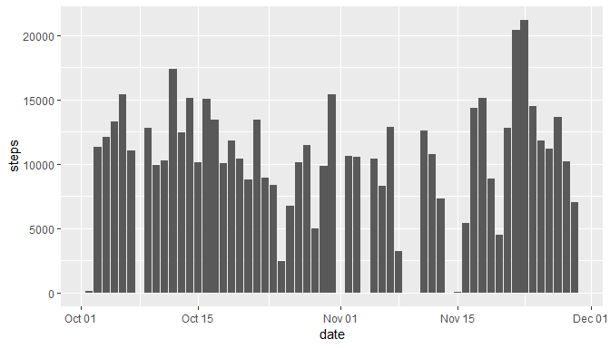
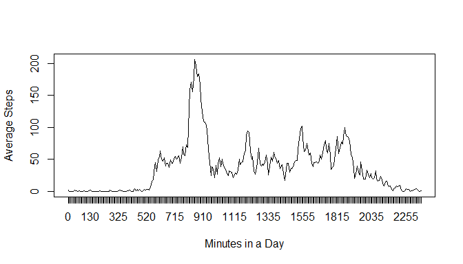
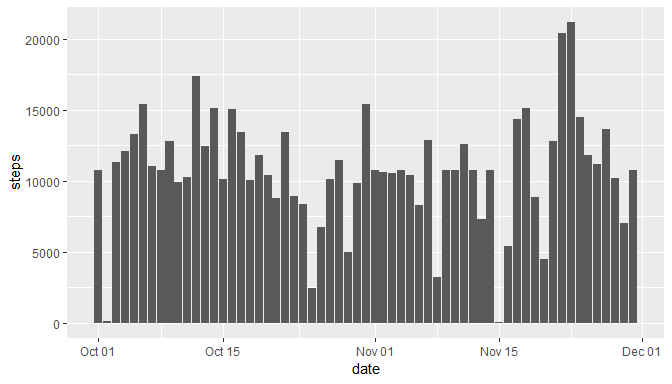
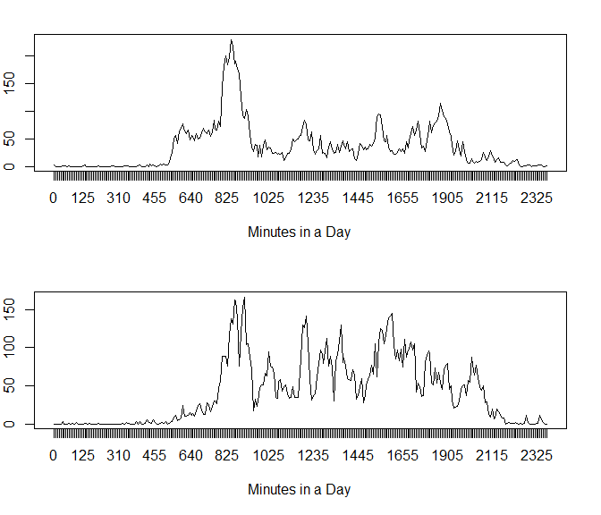

This document has been created with an R markdown file for the
Reporducible Research course available on Coursera.
<https://www.coursera.org/learn/reproducible-research/>.

Part 1
------

### Loading and preprocessing the data

Show any code that is needed to

1.  Load the data (i.e. read.csv())
2.  Process/transform the data (if necessary) into a format suitable for
    your analysis

<!-- -->

    activity <- read.csv("activity.csv")
    activity$date <- as.Date(activity$date, "%Y-%m-%d")
    activity <- as.data.frame(activity)

Part 2
------

### What is mean total number of steps taken per day?

For this part of the assignment, you can ignore the missing values in
the dataset.

1.  Calculate the total number of steps taken per day
2.  If you do not understand the difference between a histogram and a
    barplot, research the difference between them. Make a histogram of
    the total number of steps taken each day
3.  Calculate and report the mean and median of the total number of
    steps taken per day

<!-- -->

    ## Registered S3 methods overwritten by 'ggplot2':
    ##   method         from 
    ##   [.quosures     rlang
    ##   c.quosures     rlang
    ##   print.quosures rlang

    steps <- with(activity, tapply(steps, date, sum, na.rm = TRUE))
    mean(steps)

    ## [1] 9354.23

    median(steps)

    ## [1] 10395

Part 3
------

### What is the average daily activity pattern?

1.  Make a time series plot (i.e. type="l") of the 5-minute
    interval (x-axis) and the average number of steps taken, averaged
    across all days (y-axis)
2.  Which 5-minute interval, on average across all the days in the
    dataset, contains the maximum number of steps?

<!-- -->

    daymeans <- with(na.omit(activity), tapply(steps, interval, mean))
    head(daymeans)

    ##         0         5        10        15        20        25 
    ## 1.7169811 0.3396226 0.1320755 0.1509434 0.0754717 2.0943396

    daymeans[which(daymeans == max(daymeans))]

    ##      835 
    ## 206.1698

Part 4
------

### Imputing missing values

Note that there are a number of days/intervals where there are missing
values (coded as NA). The presence of missing days may introduce bias
into some calculations or summaries of the data.

1.  Calculate and report the total number of missing values in the
    dataset (i.e. the total number of rows with NAs)
2.  Devise a strategy for filling in all of the missing values in
    the dataset. The strategy does not need to be sophisticated. For
    example, you could use the mean/median for that day, or the mean for
    that 5-minute interval, etc.
3.  Create a new dataset that is equal to the original dataset but with
    the missing data filled in.
4.  Make a histogram of the total number of steps taken each day and
    Calculate and report the mean and median total number of steps taken
    per day. Do these values differ from the estimates from the first
    part of the assignment? What is the impact of imputing missing data
    on the estimates of the total daily number of steps?

<!-- -->

    sum(is.na(activity))

    ## [1] 2304

    sum(is.na(activity))/nrow(activity)

    ## [1] 0.1311475

NA values will be replaced with the daily interval mean calculated in
part 3.

Check data for NA values.

    head(activity)

    ##   steps       date interval
    ## 1    NA 2012-10-01        0
    ## 2    NA 2012-10-01        5
    ## 3    NA 2012-10-01       10
    ## 4    NA 2012-10-01       15
    ## 5    NA 2012-10-01       20
    ## 6    NA 2012-10-01       25

    tail(activity)

    ##       steps       date interval
    ## 17563    NA 2012-11-30     2330
    ## 17564    NA 2012-11-30     2335
    ## 17565    NA 2012-11-30     2340
    ## 17566    NA 2012-11-30     2345
    ## 17567    NA 2012-11-30     2350
    ## 17568    NA 2012-11-30     2355

Loop over the data and replace the missing values.

    int <- unique(activity$interval)
    len <- nrow(activity[is.na(activity),])
    NAint <-  activity[is.na(activity),3]
    NAsteps <- activity[is.na(activity),1]
    for (j in 1:2304) {
           for (i in 1:288){
                  if (NAint[j] == int[i])
                         NAsteps[j] <- daymeans[i]
           
           }
    }
    NAindex <- is.na(activity$steps)
    activity$steps<- replace(activity$steps,NAindex, NAsteps)

NA values have now been replaced.

    head(activity)

    ##       steps       date interval
    ## 1 1.7169811 2012-10-01        0
    ## 2 0.3396226 2012-10-01        5
    ## 3 0.1320755 2012-10-01       10
    ## 4 0.1509434 2012-10-01       15
    ## 5 0.0754717 2012-10-01       20
    ## 6 2.0943396 2012-10-01       25

    tail(activity)

    ##           steps       date interval
    ## 17563 2.6037736 2012-11-30     2330
    ## 17564 4.6981132 2012-11-30     2335
    ## 17565 3.3018868 2012-11-30     2340
    ## 17566 0.6415094 2012-11-30     2345
    ## 17567 0.2264151 2012-11-30     2350
    ## 17568 1.0754717 2012-11-30     2355

Values for mean and median are now reflective of the additional values
that have been imputed.

    steps <- with(activity, tapply(steps, date, sum, na.rm = TRUE))
    mean(steps)

    ## [1] 10766.19

    median(steps)

    ## [1] 10766.19

Part 5
------

### Are there differences in activity patterns between weekdays and weekends?

For this part the weekdays() function may be of some help here. Use the
dataset with the filled-in missing values for this part.

1.  Create a new factor variable in the dataset with two levels -
    "weekday" and "weekend" indicating whether a given date is a weekday
    or weekend day.
2.  Make a panel plot containing a time series plot (i.e. type="l") of
    the 5-minute interval (x-axis) and the average number of steps
    taken, averaged across all weekday days or weekend days (y-axis).
    See the README file in the GitHub repository to see an example of
    what this plot should look like using simulated data.

<!-- -->

    library(dplyr)

    ## 
    ## Attaching package: 'dplyr'

    ## The following objects are masked from 'package:stats':
    ## 
    ##     filter, lag

    ## The following objects are masked from 'package:base':
    ## 
    ##     intersect, setdiff, setequal, union

    activity <- mutate(activity, day = weekdays(activity$date))
    weekdays <- c('Monday', 'Tuesday', 'Wednesday', 'Thursday', 'Friday')
    activity$day <- factor((weekdays(activity$date) %in% weekdays), 
             levels=c(FALSE, TRUE), labels=c('Weekend', 'Weekday'))

    weekdays <- subset(activity, day == "Weekday")
    weekends <- subset(activity, day == "Weekend")
    weekendmeans <- with(weekends, tapply(steps, interval, mean))
    weekdaymeans <- with(weekdays, tapply(steps, interval, mean))

